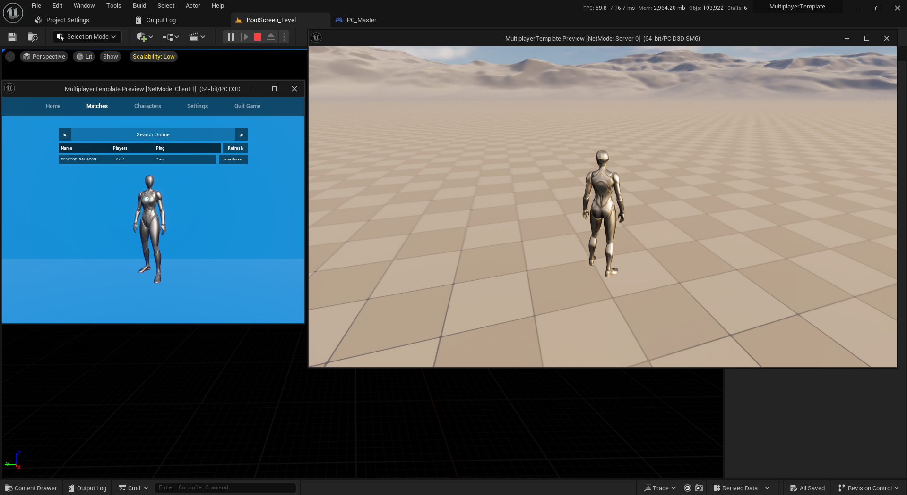
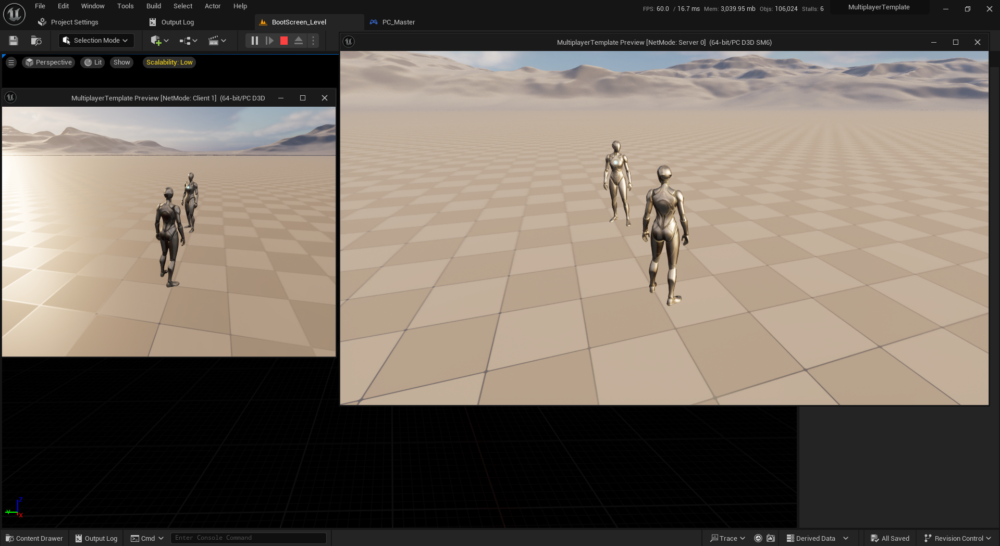

# MultiPlayer-UE
A multiplayer game template to understand multiplayer mechanics and network replication.

# Overview
This repository contains an example for Unreal Engine 5 network replication and local game hosting. It is designed to help you understand how multiplayer games work.

# Screenshot

## Screenshot 1

## Screenshot 2
